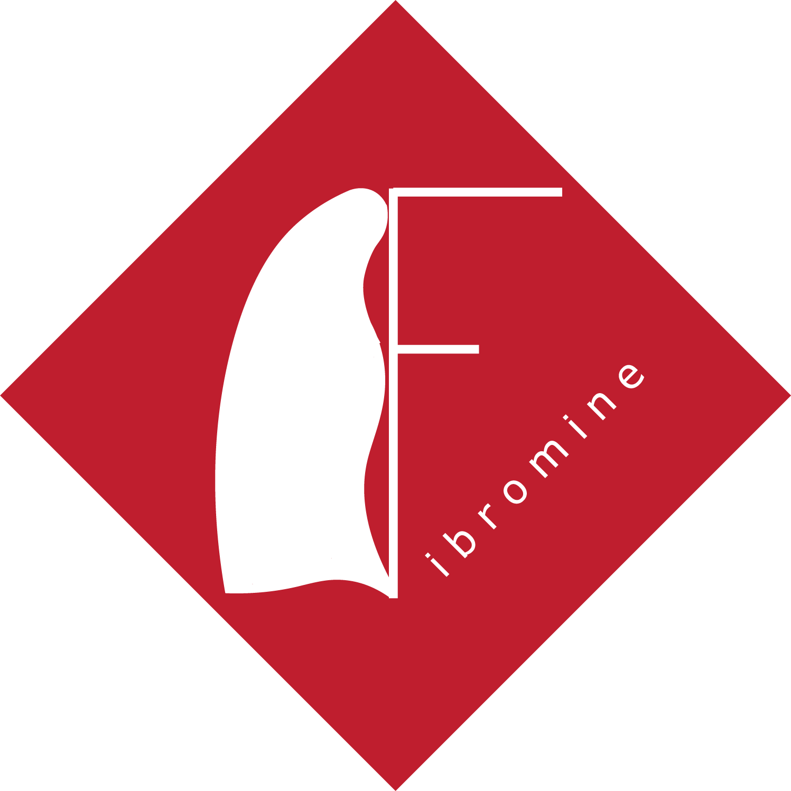

<!-- badges: start -->
  
  
  
<!-- badges: end -->

# **Fibromine: a data integration and mining tool for the acceleration of pulmonary fibrosis research**



## **R packages and javascript libraries used**

```
	shiny 
	shinyjs
	shinyBS 
	shinydashboard
	shinycssloaders 
	DT 
	heatmaply 
	RSQLite
	reshape 
	igraph 
	visNetwork
	htmlwidgets 
	openxlsx 
	rjson
	rintrojs
	datatables-rowsgroup (Alexey Shildyakov)
```