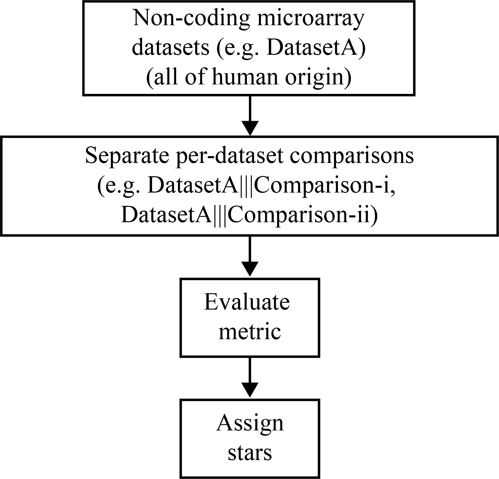
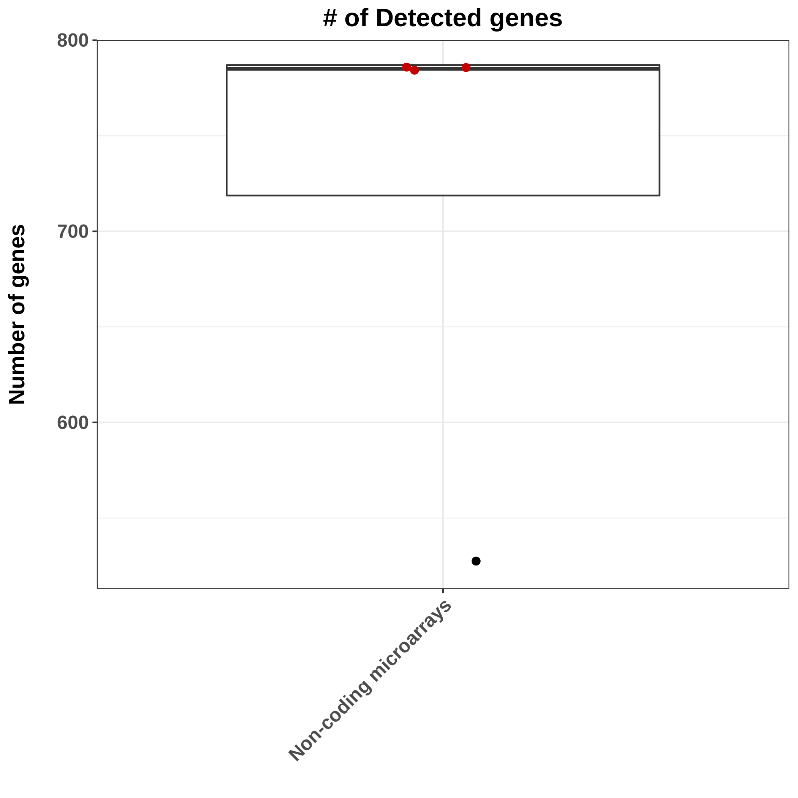
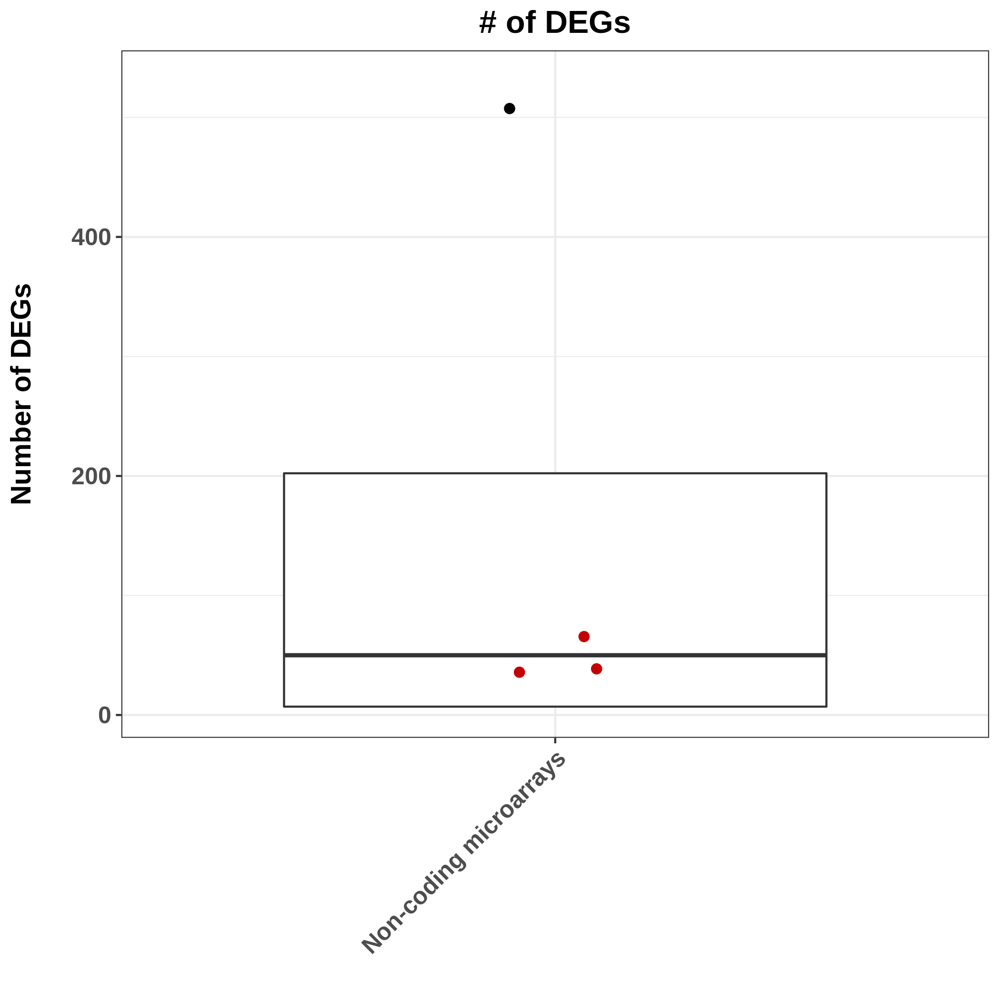
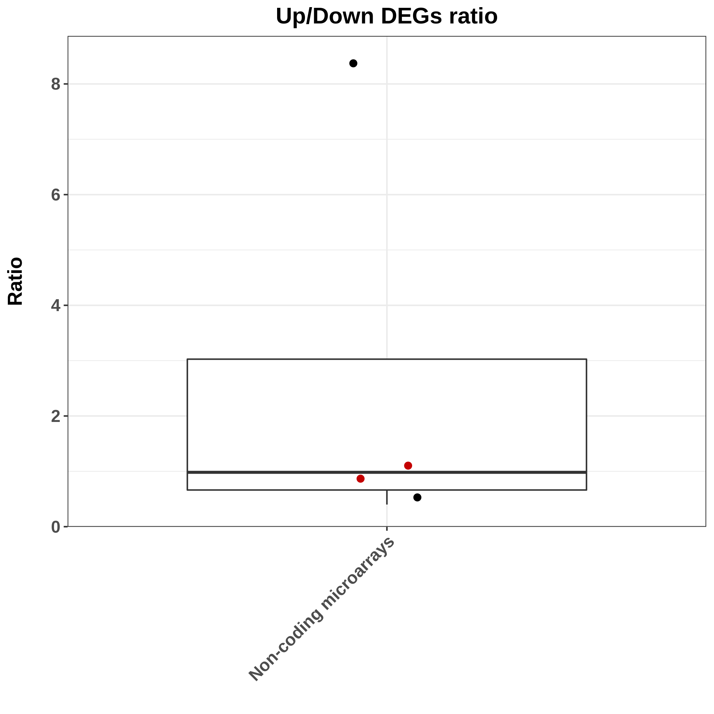
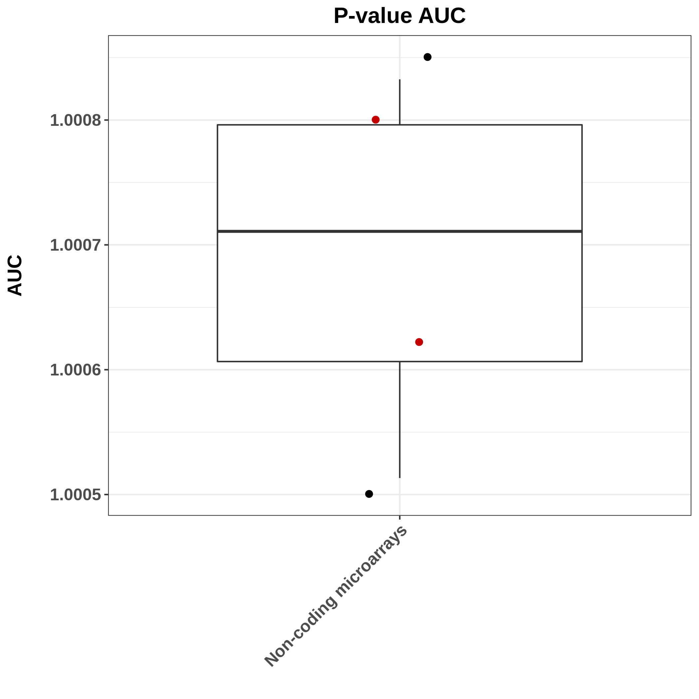
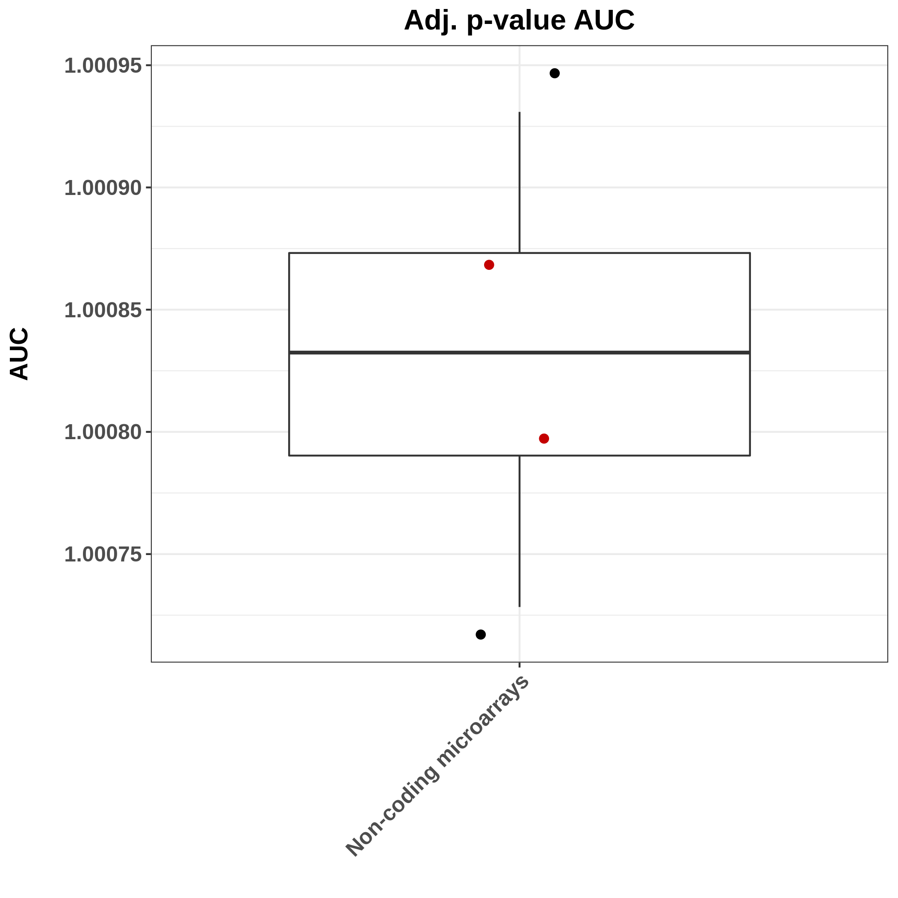

#### Non-coding microarray datasets benchmarking

In this tab we **visually** present the **process** followed for the benchmarking of all **non-coding microarray datasets** along with the respective **per metric boxplots**. At the **end** of this **tab**, the user can also **analytically interrogate** the stars assigned to each dataset/comparison.

##### Benchmarking pipeline

##### Fibrotic genes expression

_In this metric we count **how many of each dataset's DEGs** have been **previously reported as profibrotic**. (Dataset's DE orientation must match to this reported in literature for a gene to be counted.) The genes assessed were those reported by **Vukmirovic et al. 2018**, along with **some already known**. In the case of **mouse datasets**, the **homologues** to human genes (as defined into Ensembl) were used._

This metric was **not** used for non-coding datasets, as all used fibrotic genes are protein-coding.

##### Detected genes 

In this metric we calculate how many genes were **detected** per dataset/comparison.

##### Differentially expressed genes (DEGs)

For this metric we calculate DEGs found in each dataset/comparison (DEA thresholds: 1.2 FC; 0.05 FDR).

##### Up/Down DEGs ratio

Up/Down DEGs ratio metric is based on the distribution of up-regulated to down-regulated genes found in each dataset/comparison. (Ratio=1 signifies an even participation of Up and Down regulated genes.)

##### FC bins

The following boxplots depict the proportions of DEGs found in three bins of **absolute FC** values for each Fibromine dataset/comparison where DEGs were found. (Low: 1.2-2, Intermediate= 2-5, High= >5)

In order to assign a star based on this metric to a dataset/comparison, a **two steps procedure** is followed:

1. Each dataset/comparison gets from 0 to 3 stars according to its position at the distribution of **each one** of the \|FC\| bins 
2. The aforementioned stars are **summarized** into a consensus star assigned to each dataset/comparison if the latter has collected **2/3** of the individual stars

	

##### P-value distribution Area Under the Curve

##### Adjusted p-value distribution Area Under the Curve

