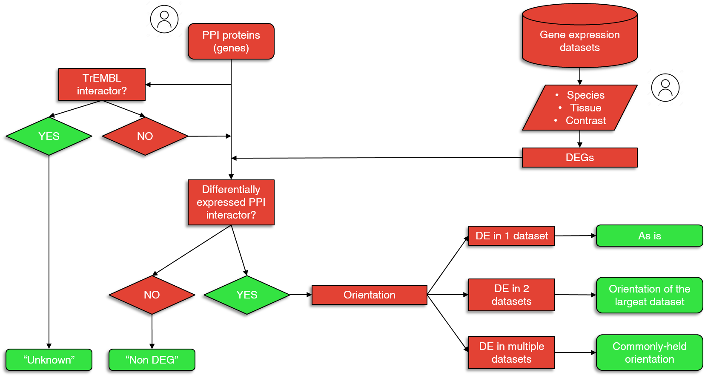

<link rel="stylesheet" type="text/css" media="all" href="./textStyles.css">

# Fibromine documentation page

---

## Dataset explorer

**Dataset explorer** enables the exploration and integration of all FibromineDB datasets. By clicking on any combination of the datasets displayed at the *Transcriptomic datasets* > *Datasets* tab or *Proteomic datasets* > *Datasets* tab tables and then pressing the *Search* button, the user can interrogate the consensus deregulated genes and proteins found on these datasets, respectively. **Results are presented at the *DEA statistics* tab for the transcriptomics datasets and at the *DEA data* tab for the proteomic datasets.**

A gene/protein is defined as consensus deregulated if it has been found differentially expressed in at least half of the user selected datasets. Data regarding those genes/proteins are presented at the *Transcriptomic datasets* > *DEA statistics* > *Transcriptomics analytically* and *Proteomic datasets* > *DEA data* > *Proteomics analytically* tables, respectively, while *Transcriptomics summary* and *Proteomics summary* tables summarize the aforemenioned information.

For the consensus fold change (*log2FcAve*) presented at the *Transcriptomic datasets* > *DEA statistics* > *Transcriptomics summary* table we perform the following computations for each gene exclusively:

1. Define the most frequent direction of deregulation across the selected datasets (up or down regulation)
2. Isolate those datasets presenting the most frequent direction of deregulation
3. Calculate and present the average fold change value across the datasets selected at step 2.

For the consensus direction of deregulation (*Expression direction*) displayed at the *Proteomic datasets* > *DEA data* > *Proteomics summary* table, the most frequent direction is chosen. If a protein is found differentially expressed in only two datasets and with a inconsistent direction of deregulation, this protein is not included into the *Proteomics summary* table, but can still be reviewed in the *Proteomics analytically* table. The same case applies for similar cases of the transcriptomics data.

**Note:** If a single transcriptomic or proteomic dataset is selected by the user, no data integration is performed resulting in the *[...] summary* and *[...] analytically* tables being identical to each other. 

**Note:** Differential gene expression is defined using, by default, a fold change of 1.2 and a p-value threshold of 0.05. The user can change the thresholds from the control panel at the left part of the *Transcriptomic datasets* > *DEA statistics* tab.

**Note:** Although half of the user-selected datasets are used as the minimum threshold for a gene/protein to be called consensus differentially expressed and to be presented as such, the user can further toughen this threshold via the *Out of n Datasets* column of the *Transcriptomics summary*/*Proteomics summary* tables, thus limiting the number of the reported consensus deregulated genes.

Finally, through *Dataset explorer* one can plot per a dataset heatmap and volcano plot. For the heatmap plot, the top 1000 most variable differentially expressed genes are taken into consideration, while for the volcano plot, a |FC| threshold of 1.2 and a p-value threshold of 0.05 are used. 

---

## Gene explorer

Gene explorer supports the examination of the expression patterns for a single or multiple protein coding and non-coding genes of human and/or mouse origin. For the protein coding genes, apart from the transcriptomic data, a proteomic signature of deregulation fetched from the included proteomic datasets is also returned. Finally, *Gene ontology* and *RefSeq - miRNA* tabs report useful information regarding the queried genes.

**Note:** Gene search is **case-insensitive** and accepts either an **Ensembl gene ID** or the respective valid **HGNC symbol**.

**Note:** **miRNA search** is also supported to retrieve data from "Non-coding RNA
expression arrays". User can search for an miRNA using the respective miRBase accession or ID (e.g. **MIMAT0000446** or **hsa-miR-127-3p**).

---

## Protein explorer

**Note!** Search in the Protein explorer must follow official HGNC nomenclature or Ensembl gene IDs and in contrast to Gene explorer is **case sensitive**.

**Protein explorer** enables the exploration of protein expression data and some general annotation regarding the protein of interest, provided as input the name of the respective coding gene. 

The main feature of the explorer is the creation of context-specific protein-protein interaction (PPI) networks, based on STRINGdb and transcriptomics expression data of
FibromineDB. *Note: available proteomic data are able to cover only a few proteins and thus were not used for PPI networks annotation.* 

Currently, the networks created consist of **two shells** in which only **_high confidence_** interactions are included (interaction score > 700). Briefly, the first shell includes **maximum 9** interactors and the queried protein, while the second **18 interactors** maximum (the two most confident interactors for each of the 9 proteins of the first shel interacting with the queried protein). Technically, a **DrL** layout is applied on the network, with protein interaction scores used as edge weights. *Note: PPI interaction network visualizations can be downloaded with right click on the plot and then choosing the "Save image as..." option.*

To annotate a general PPI network the user should use the panel at the right of the "PPI network tab".  The nodes of the resulting network are colored based on whether the respective genes are:

1. differentially expressed (**red** for the upregulated or **blue** for the downregulated ones) 
2. or not (**grey**). 

Nodes maintaining the previously used color (also named by their STRINGdb ID) 
represent **TrEMBL** proteins that are currently **not supported** by Fibromine, and thus their expression status cannot be assayed. Data used for each context-specific annotation are displayed for inspection at the last tab of the explorer, *Data used* tab.

The internal process applied to annotate the network is described in **_Workflow 1_**.

**Workflow 1:** Back-end process for context-specific PPI networks creation.

**Note:** To re-annotate an already annotated PPI network, please, reset the parameters using the homonym button

---

## Datasets benchmarking tab

Dataset benchmarking tab presents the results of a custom datasets benchmarking process that is implemented to facilitate the user in the selection of the most "interesting" datasets to work with.

The basic concept of the applied strategy is to interrogate all transcriptomic datasets using a set of seven metrics, post to datasets/comparisons separation based on species and technology (microarrays/RNA-seq). For each of the dataset/comparison groups we shape a per metric distribution and each dataset receives a star each time its metric value lies within a pre-specified range of the respective metric. The bigger number of stars a dataset has collected, the more "trustworthy" it is considered.

The seven metrics along with the pre-defined ranges in which a dataset receives a star are:

|     | Metric | Range |
| --- | ---    | ---   |  
| 1.  | Number of detected genes | Median to 90th percentile|
| 2.  | Number of differentially expressed genes | Inter-quartile range |
| 3.  | Representation of a number of already known | |
|     | pro-fibrotic genes among the differentially | Above the median | 
|     | expressed ones | |
| 4.  | The number of differentially expressed genes | |
|     | falling in each of three absolute FC bins: | Inter-quartile range | 
|     | low (1.2,2) , intermediate [2,5) and high [5,) | |
| 5.  | Up/Down differentially expressed genes ratio | Inter-quartile range | 
| 6.  | The area under the p-value curve | Inter-quartile range |
| 7.  | The area under the adjusted p-value curve | Inter-quartile range |

---

## Download data tab

Normalized gene expression data and preomics differential expression data can be downloaded from the drop-down menus of the *Download data* tab using the ID of each dataset. The latter can be reviewed via the *Transcriptomic datasets* > *Datasets* and *Proteomic datasets* > *Datasets* tables of *Dataset explorer*, respectively.