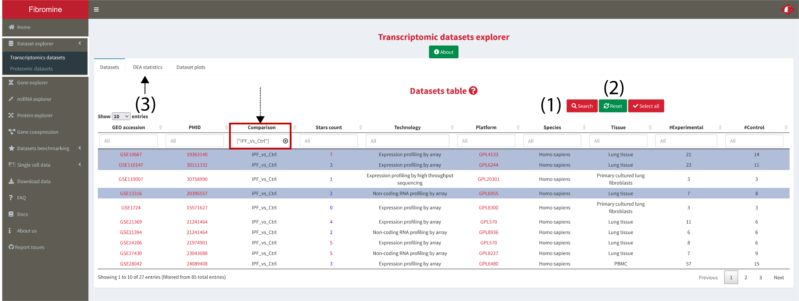
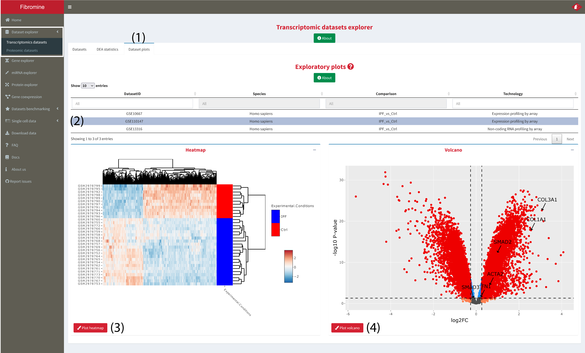

1. Go to **Dataset explorer --> Transcriptomic datasets --> Datasets tab** and **choose** (via clicking) the dataset/comparison of interest from the displayed table as shown below. To begin integration **press the Search button (1)** and you will be redirected to the **results tab (3)**. To **reset** analysis input it is recommended to **reset** parameters via the **homonym button (2)**. *Note: Every column of the table can be dynamically filtered.*

	

2. If more than one datasets have been selected then consensus differentially expressed genes are presented at the **Transcriptomics summary** tab **(2)**, with **log2FcAve (6)** column holding the consensus fold change values. In the case of a single dataset interrogation the aforementioned tab displays the same data presented at the **Transcriptomics analytically** tab **(4)**, namely all the DEA results of the dataset. **Proteomics summary** tab **(3)** presents the differentially expressed proteins, if any, coded by the genes of the *Transcriptomics summary* tab.

	Analysis can be further fine-tuned using the **Out of ... Datasets (5)** column (see Docs for mor details), as well as by changing the default **p-value and FC thresholds (7)**.

	The user can also perform **pathway analysis (8)** using the concensus differentially expressed genes presented in (2). The gene groups used as background for the analysis can be filtered from within the results table **(9)**.

	

	

	

3. **Dataset plots** tab (1) gives to the user the ability to plot an interactive heatmap and volcano plot for any of the datasets queried in step 1. **To plot** any of the two, **select a dataset** from the tab's table (2) and then **press the respective _Plot_ button**, **(3-4)**.

	
