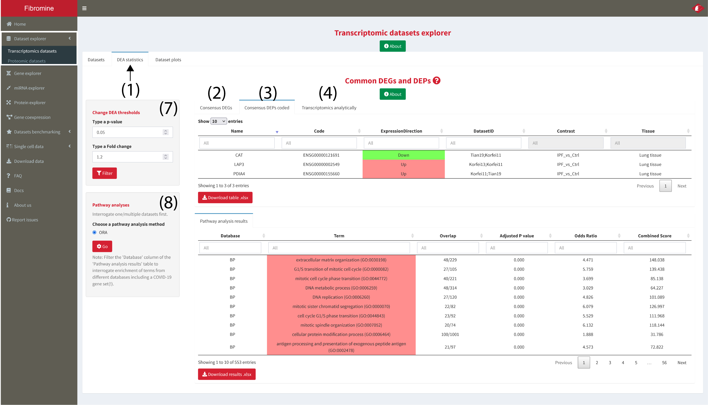
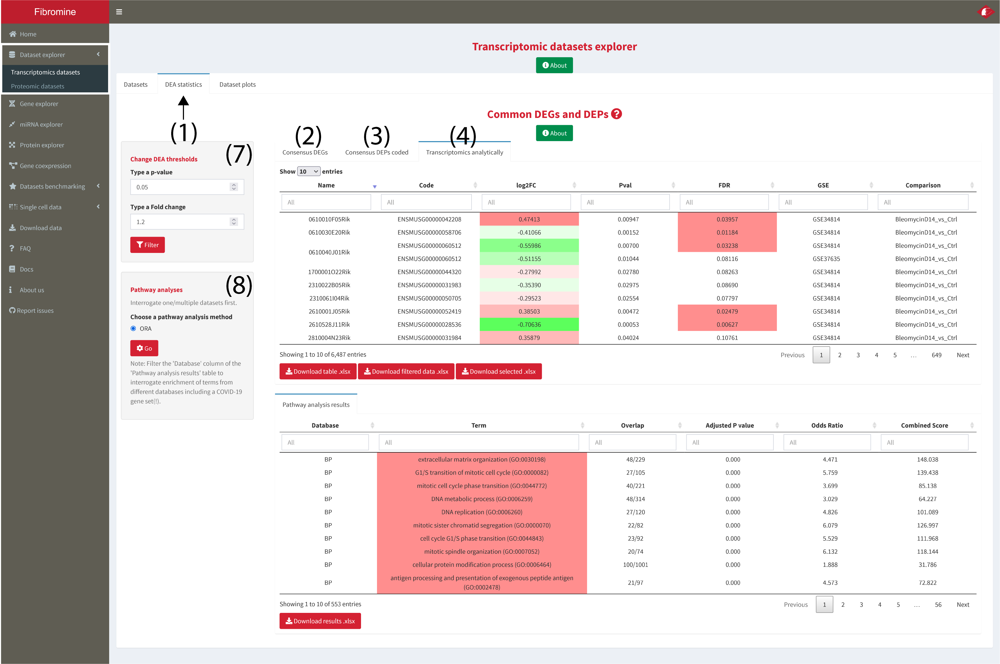

1. Go to **Dataset explorer --> Transcriptomic datasets --> Datasets tab** and **choose** (via clicking) the dataset/comparison of interest from the displayed table as shown below. To begin integration **press the Search button (1)** and you will be redirected to the **results tab (3)**. To **reset** analysis input it is recommended to **reset** parameters via the **homonym button (2)**. *Note: Every column of the table can be dynamically filtered.*

	

2. Across species consensus differentially expressed genes can be found at the **Transcriptomics summary** tab **(2)**. For data display, only the **human homologues** are presented in (2), with **log2FcAve (6)** column holding the consensus fold change values among the human sampling datasets. The murine counterparts are of the same direction of deregulation (up/down) and can be inspected from the **Transcriptomics analytically** tab **(4)**. **Proteomics summary** tab **(3)** presents the differentially expressed proteins, if any, coded by the genes of *Transcriptomics summary* tab. 

	Analysis can be further fine-tuned using the **Out of ... Datasets (5)** column (see Docs for more details), as well as by changing the default **p-value and FC thresholds (7)**.

	The user can also perform **pathway analysis (8)** using the concensus differentially expressed genes presented in (2). The gene groups used as background for the analysis can be filtered from within the results table **(9)**.

	

	

	
