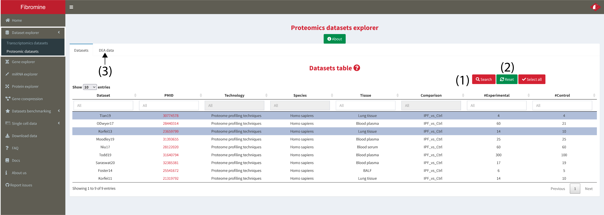
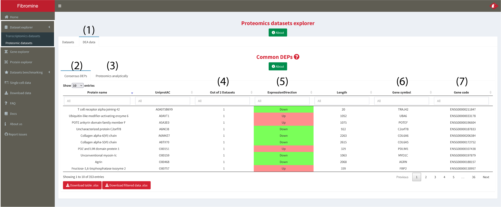
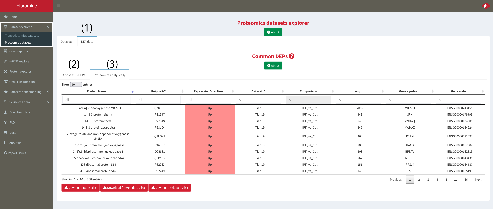

1. Go to **Dataset explorer --> Proteomic datasets --> Datasets tab** and **choose** (via clicking) the dataset/comparison of interest from the displayed table as shown below. To begin analysis **press the _Search_ button (1)** and you will be redirected to the **results tab (3)**. To **reset** analysis input it is recommended to **reset** parameters via the **homonym button (2)**. *Note: Every column of the table can be dynamically filtered.* 

	

2. If more than one datasets have been selected then consensus differentially expressed proteins are presented at the **Proteomics summary** tab **(2)**. In the case of a single dataset interrogation the aforementioned tab displays the same data presented at the **Proteomics analytically** tab **(3)**, namely all the DE proteins of the queried datasets. **Out of ... Datasets (3)** column enables a better control on the reported differentially expressed features just like in the transcriptomic datasets, while **ExpressionDirection (4)** column holds the consensus direction of deregulation. Columns **(5-6)** host data regarding the **genes coding** the queried proteins.

	

	
