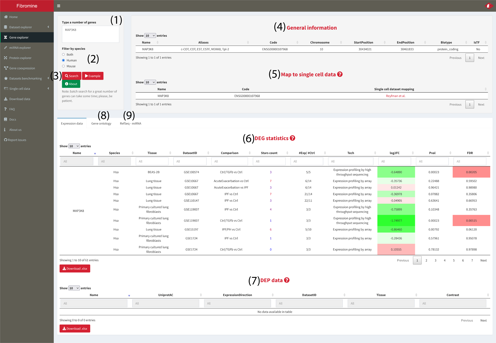
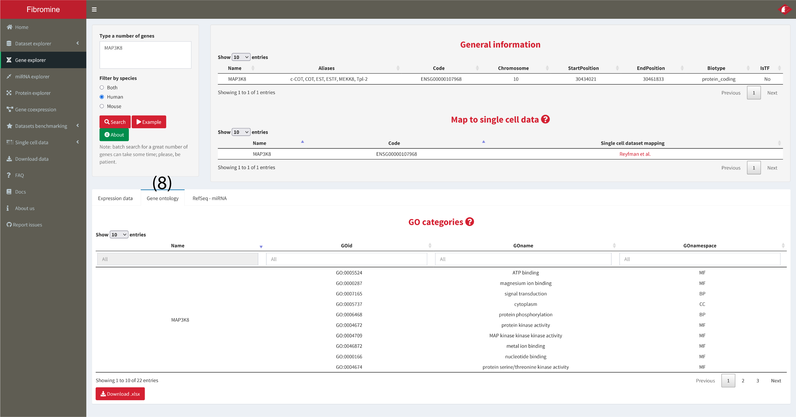
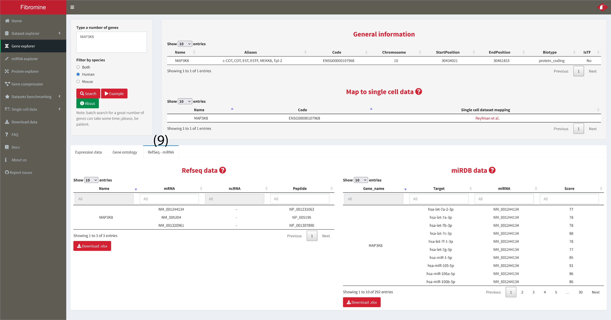

1. Navigate to the **Gene explorer** and type your gene(-s) of interest into the **search box (1)**. Then select in which of the supported species you want to search using the **radio buttons (2)** below the search box and finally press the **Search button (3)**. The results presented into the following screenshots can be replicated using the **Example button (4)**. For more details please hover over any of the aforementioned buttons/boxes or even press on the **About [...]** buttons of the tab.

	

2. The results of the respective query are constructed as thus: (i) the **Queried genes (4)** box displays some general information regarding the queried genes, (ii) differential expression statistics for the gene(-s) queried are visualized into the **Expression data tab --> DEG statistics table (6)**, (iii) if there are any differentially expressed proteins (in the proteomics datasets) coded by the queried genes, these are presented at the **Expression data tab --> DEP statistics table (7)** at the bottom of the page, (iv) Gene ontology terms associated with the gene(-s) of interest are presented at the **Gene ontology tab (8)** and finally, (v) any RefSeq related sequences or miRNA-mRNA potential interactions as described in miRDB are presented at the **RefSeq - miRNA tab (9)**. Finally, to map queried genes to the NU-Pulmonary online resource in a species-specific fashion use the **Map to single cell data (5)** feature hyperlinks. 
	
	
	
