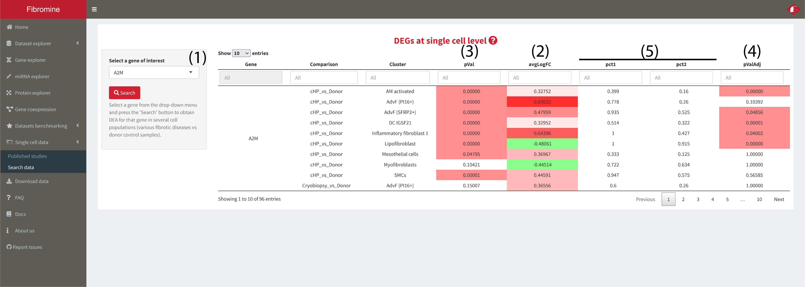

1. Navigate to **Single cell data > Search data** tab, select from the **drop-down list (1)** a gene of interest and press the **"Search"** button.

	**avgLogFC (2)** is color coded according to the **direction** of gene expression deregulation (**red shadows** for **positive fold changes** and **green shadows** for **negative** ones).	**pVal (3)** and **pValAdj (4)** columns are colored **red** each time the respective value is **< 0.05**. Columns **pct1/ pct2 (5)** record the **percentage of cells** from **each comparison part** that express the queried gene.

	

2. For a **visual** inspection of feature expression, please, use the **Map to single cell data** tool of **Gene explorer**. See **FAQ 4**.