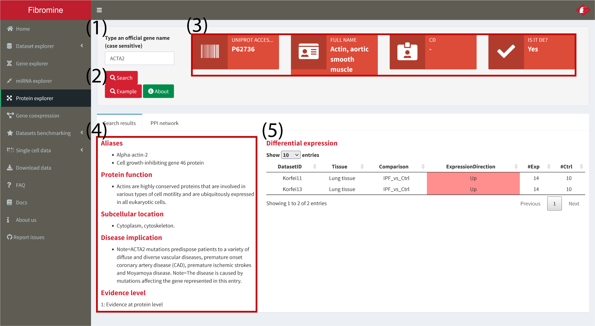

Navigate to the **Protein explorer**, type the name of the gene coding your protein of interest into the **search box (1)** at the upper left corner of the explorer and then press the **Search (2)** button below. The results presented are constructed as thus: 

- the **info boxes (3)** at the top of the page summarise some important information regarding the protein queried, 
- the **Search results (4)** tab displays some general information sourced from UniProt/SwissProt,
- the **differential expression results**, if any, are presented at the homonym table **(5)**

*Note: the results presented in the following example screenshots can be recreated by pressing the Example button below the Search button of the explorer.*

