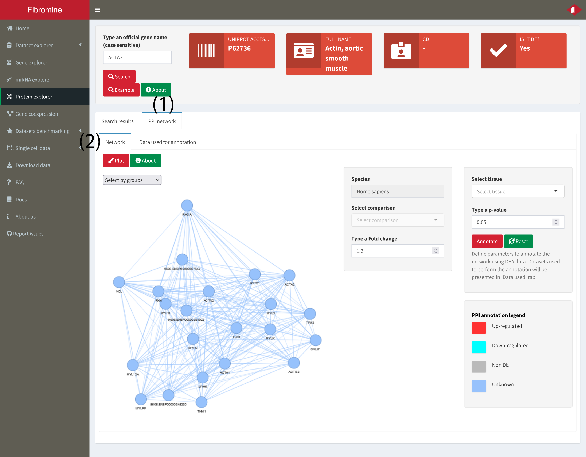
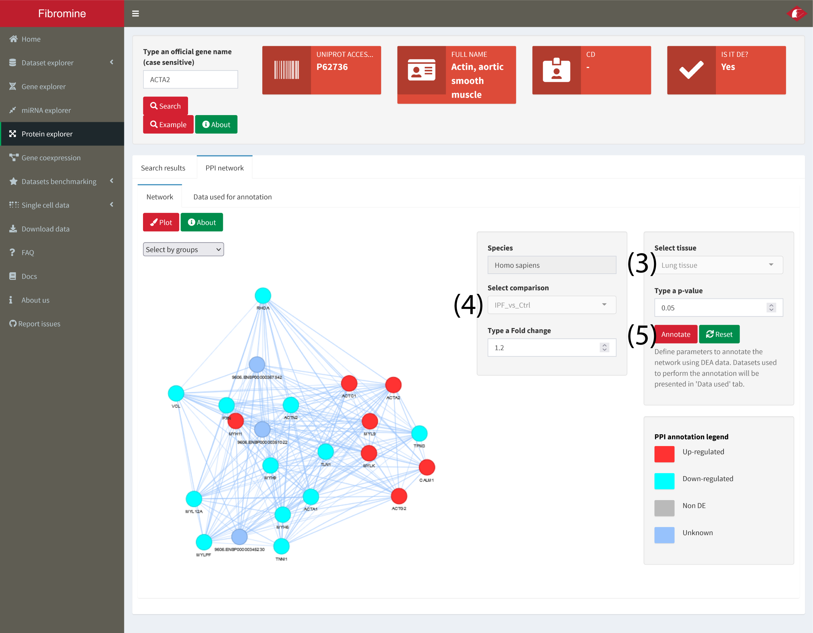

1. To construct a condition specific protein-protein interaction (PPI) network, first search for a specific protein as described in step 1 of **3. Search for the expression pattern of a specific protein.**.

2. Then, move to the **PPI network (1)** tab of the **Protein explorer** and press the **Plot (2)** button. The network should be created within a few seconds.

	

3. To annotate the network **select tissue (3)** and then **comparison (4)** from the homonym dropdown menus at the right of the network. Finally press the **Annotate (5)** button and wait for a few seconds. In order to annotate the network using data from different conditions, press the **Reset** button next to **Annotate (5)**. To further fine-tune network annotation, change the p-value and fold change thresholds used.

	

4. For transparency reasons, the data used to annotate the network are presented into the **Data used (6)** tab.
	
	
