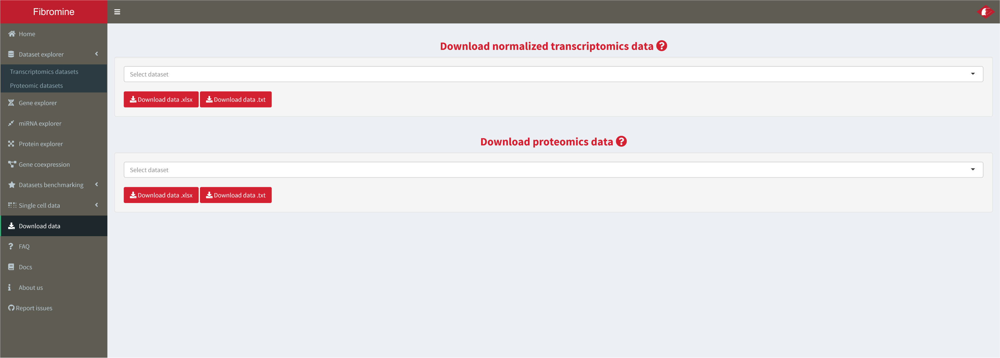

1. To download data for any downstream analysis/procedure, navigate to the **Download data** tab and use the **dropdown menus (1-2)** of the page to fetch the normalized data of any transcriptomic dataset, or the differential expression data of any proteomic one.

	
