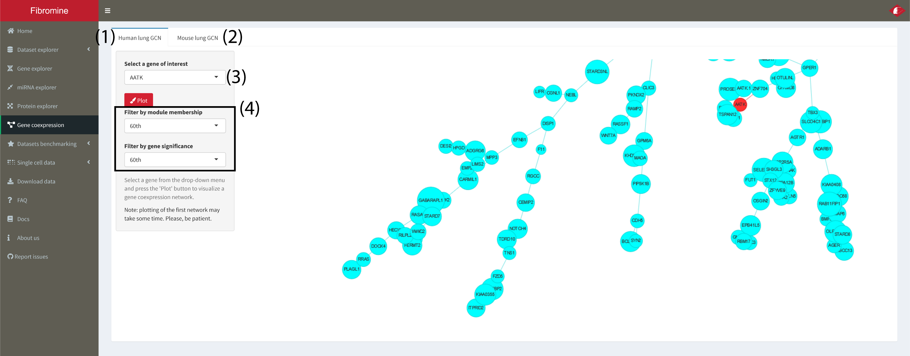
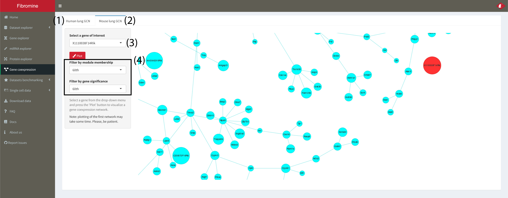

1. **IPF_vs_Ctrl lung (1)** and **BleomycinD14_vs_Ctrl (2)** gene co-expression networks (GCN) can be created via the **Gene coexpression** tab.  

	

2. **Select** any of the genes from the **drop-down menu (3)** and then press the **"Plot"** button. **Queried** gene is colored **red**. 
	**Note!!! Per species first** network creation can take some **seconds more**. Please, be patient.

3. Depicted network members belong to the **same co-expression module** with the queried gene and have **by default** a **module membership (MM)** and **gene significance (GS)** value above the **60th percentile** of the respective distribution. These values can be **tuned** using the panel at the **left (4)**. 

4. Network **edges** represent **TOM** (Topology Overlap Measure) values **above the 3rd quartile** of the respective module's distribution. **No** node is allowed **not** to have an edge, apart from the **queried** gene. 
	
	
