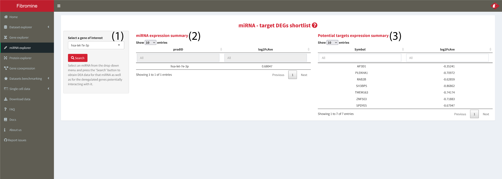

1. Navigate to the **miRNA explorer**, choose any of the **miRNAs** found differentially expressed in **IPF compared to Ctrl lung (1)** and press the **"Search"** button.

	**miRNA expresion summary (2)** returns expression statistics for the queried gene. **Potential targets expression summary (3)** records the same statistics for potential **mRNA** interactors (miRDB-sourced) having the **opposite** direction of deregulation from the miRNA selected. 

	
