## An image-based guide of Fibromine

#### 1. How to explore a single dataset using the <i class="fas fa-database"></i> Dataset explorer?

##### 1.1 Explore one - or integrate multiple single species - transcriptomics datasets 

1. Go to **Dataset explorer --> Transcriptomic datasets --> Datasets tab** and **choose** (via clicking) the dataset/comparison of interest from the displayed table as shown below. To begin integration **press the Search button (1)** and you will be redirected to the **results tab (3)**. To **reset** analysis input it is recommended to **reset** parameters via the **homonym button (2)**. *Note: Every column of the table can be dynamically filtered.*

	

2. If more than one datasets have been selected then consensus differentially expressed genes are presented at the **Transcriptomics summary** tab **(2)**, with **log2FcAve (6)** column holding the consensus fold change values. In the case of a single dataset interrogation the aforementioned tab displays the same data presented at the **Transcriptomics analytically** tab **(4)**, namely all the DEA results of the dataset. **Proteomics summary** tab **(3)** presents the differentially expressed proteins, if any, coded by the genes of the *Transcriptomics summary* tab.

	Analysis can be further fine-tuned using the **Out of ... Datasets (5)** column (see Docs for mor details), as well as by changing the default **p-value and FC thresholds (7)**.

	The user can also perform **pathway analysis (8)** using the concensus differentially expressed genes presented in (2). The gene groups used as background for the analysis can be filtered from within the results table **(9)**. 

	<a href= "howToScreenshots/datasetExpl2.png" target="_blank" rel='noopener noreferrer'> 
		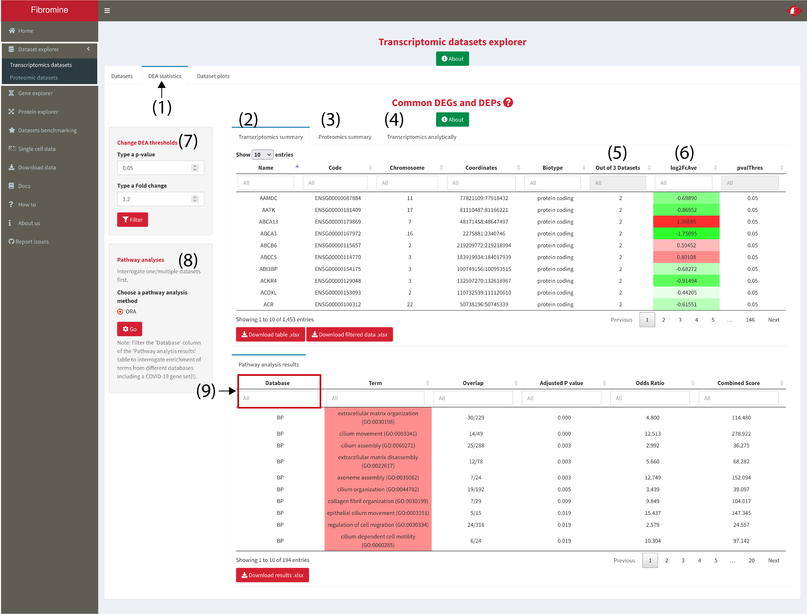
	</a>

	<a href= "howToScreenshots/datasetExpl3.png" target="_blank" rel='noopener noreferrer'> 
		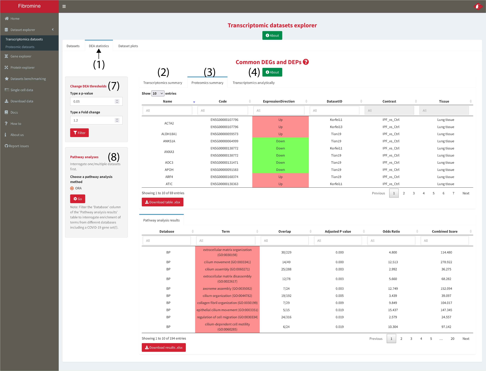
	</a>

	<a href= "howToScreenshots/datasetExpl4.png" target="_blank" rel='noopener noreferrer'> 
		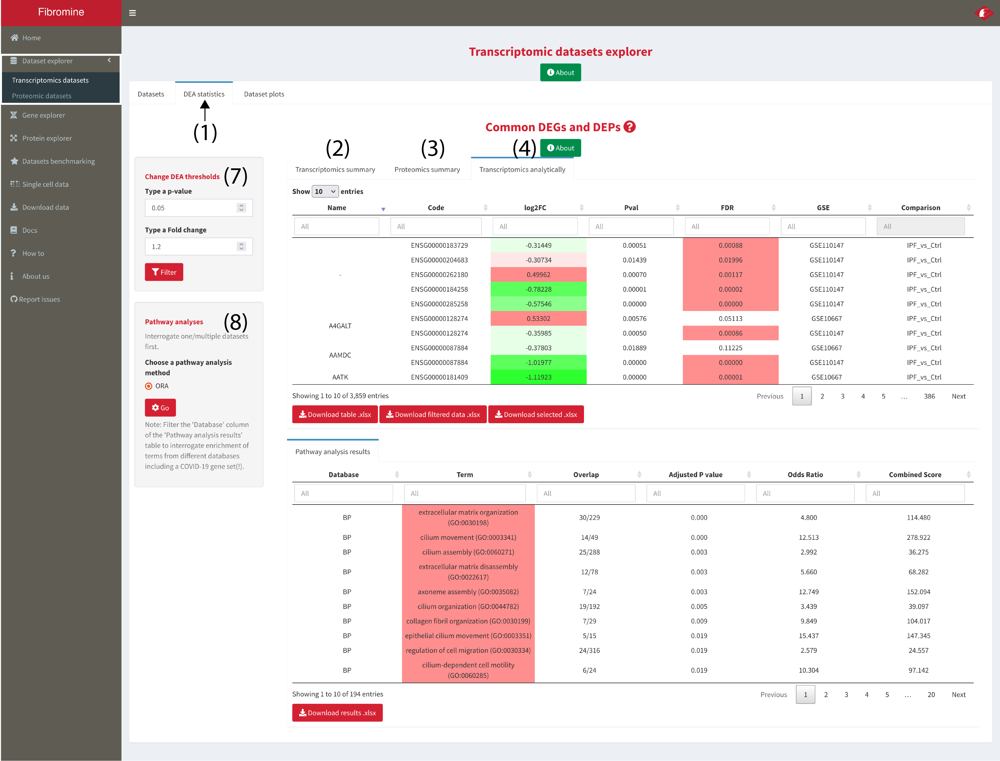
	</a>

3. **Dataset plots** tab (1) gives to the user the ability to plot an interactive heatmap and volcano plot for any of the datasets queried in step 1. **To plot** any of the two, **select a dataset** from the tab's table (2) and then **press the respective _Plot_ button**, **(3-4)**.

	<a href= "howToScreenshots/datasetExpl5.png" target="_blank" rel='noopener noreferrer'> 
		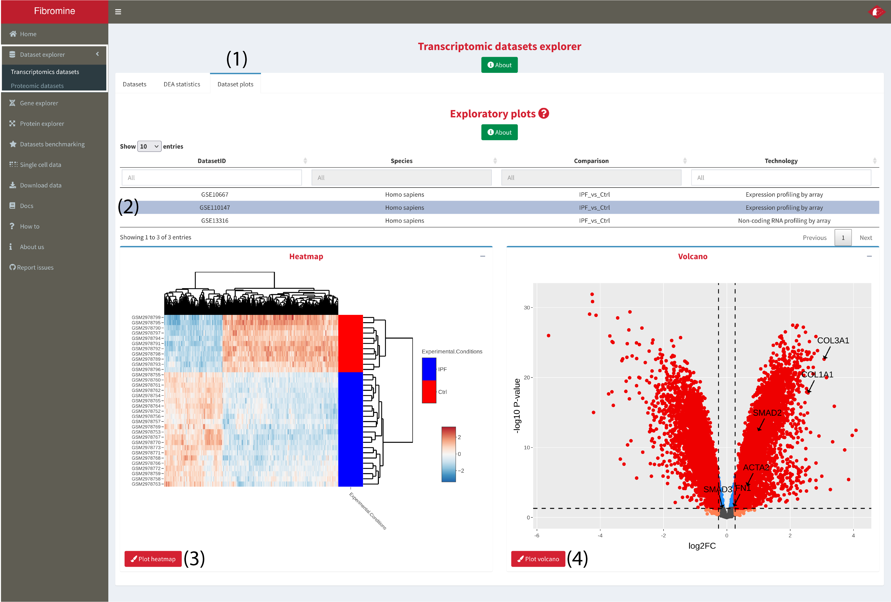
	</a>

##### 1.2 Integrate datasets across species

1. Go to **Dataset explorer --> Transcriptomic datasets --> Datasets tab** and **choose** (via clicking) the dataset/comparison of interest from the displayed table as shown below. To begin integration **press the Search button (1)** and you will be redirected to the **results tab (3)**. To **reset** analysis input it is recommended to **reset** parameters via the **homonym button (2)**. *Note: Every column of the table can be dynamically filtered.*

	<a href= "howToScreenshots/datasetExpl6.png" target="_blank" rel='noopener noreferrer'> 
		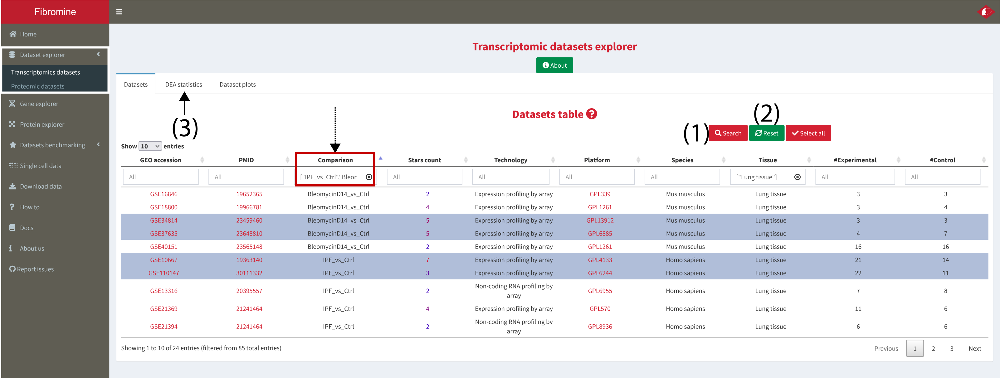
	</a>

2. Across species consensus differentially expressed genes can be found at the **Transcriptomics summary** tab **(2)**. For data display, only the **human homologues** are presented in (2), with **log2FcAve (6)** column holding the consensus fold change values among the human sampling datasets. The murine counterparts are of the same direction of deregulation (up/down) and can be inspected from the **Transcriptomics analytically** tab **(4)**. **Proteomics summary** tab **(3)** presents the differentially expressed proteins, if any, coded by the genes of *Transcriptomics summary* tab. 

	Analysis can be further fine-tuned using the **Out of ... Datasets (5)** column (see Docs for more details), as well as by changing the default **p-value and FC thresholds (7)**.

	The user can also perform **pathway analysis (8)** using the concensus differentially expressed genes presented in (2). The gene groups used as background for the analysis can be filtered from within the results table **(9)**.

	<a href= "howToScreenshots/datasetExpl7.png" target="_blank" rel='noopener noreferrer'> 
		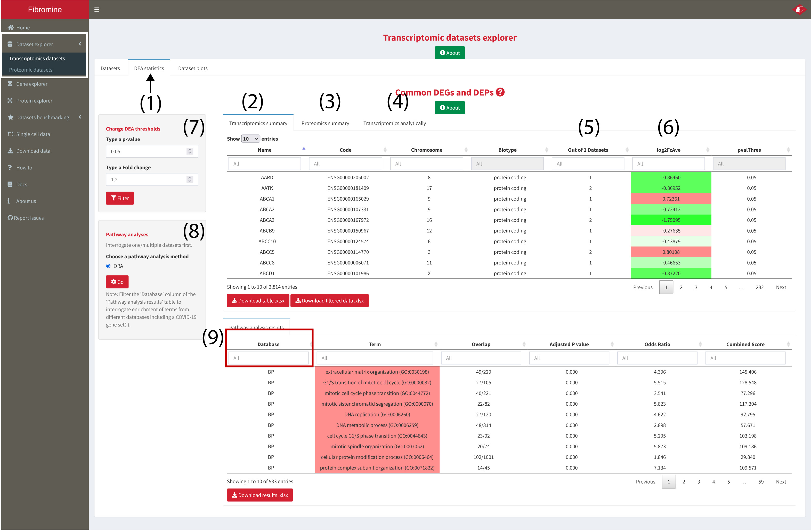
	</a>

	<a href= "howToScreenshots/datasetExpl8.png" target="_blank" rel='noopener noreferrer'> 
		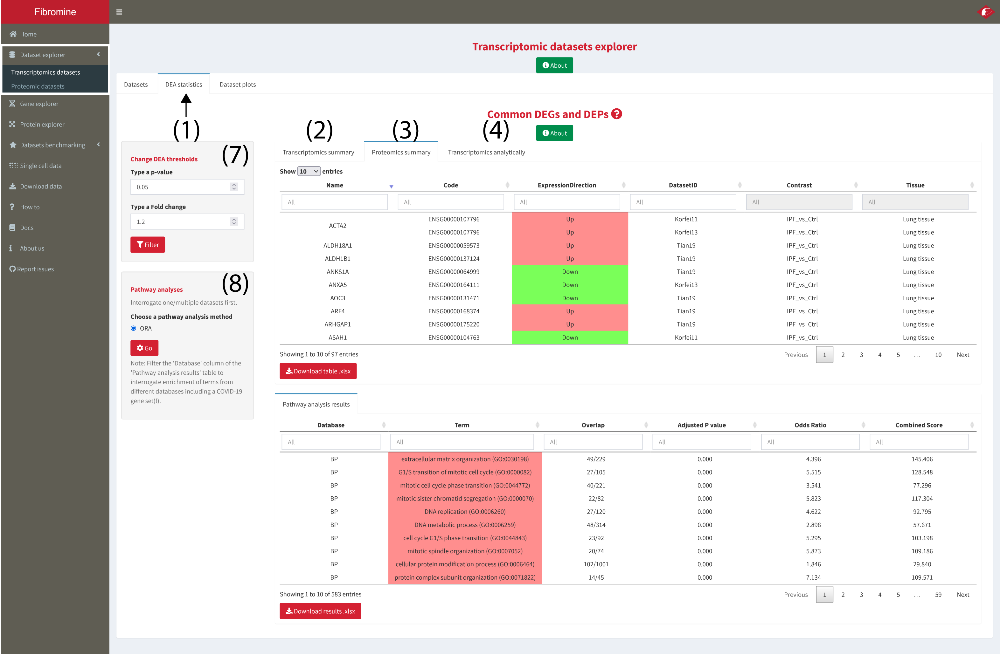
	</a>

	<a href= "howToScreenshots/datasetExpl9.png" target="_blank" rel='noopener noreferrer'> 
		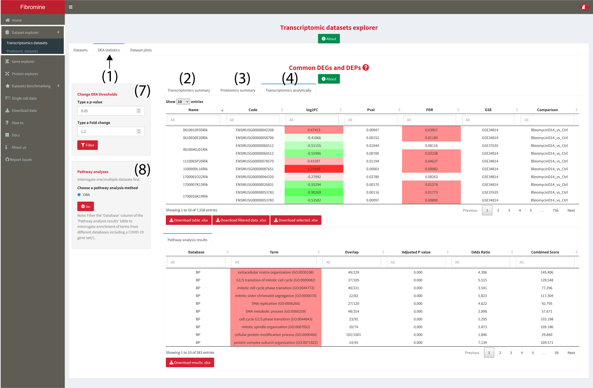
	</a>

##### 1.3 Explore one - or integrate multiple - proteomics dataset
	
1. Go to **Dataset explorer --> Proteomic datasets --> Datasets tab** and **choose** (via clicking) the dataset/comparison of interest from the displayed table as shown below. To begin analysis **press the _Search_ button (1)** and you will be redirected to the **results tab (3)**. To **reset** analysis input it is recommended to **reset** parameters via the **homonym button (2)**. *Note: Every column of the table can be dynamically filtered.* 

	

2. If more than one datasets have been selected then consensus differentially expressed proteins are presented at the **Proteomics summary** tab **(2)**. In the case of a single dataset interrogation the aforementioned tab displays the same data presented at the **Proteomics analytically** tab **(3)**, namely all the DE proteins of the queried datasets. **Out of ... Datasets (3)** column enables a better control on the reported differentially expressed features just like in the transcriptomic datasets, while **ExpressionDirection (4)** column holds the consensus direction of deregulation. Columns **(5-6)** host data regarding the **genes coding** the queried proteins.

	

	<a href= "howToScreenshots/datasetExpl12.png" target="_blank" rel='noopener noreferrer'> 
		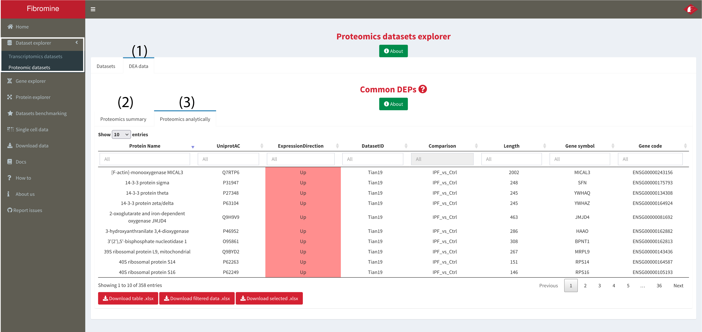
	</a>

---

#### 2. How to search for the expression pattern of a specific (or multiple) gene?

1. Navigate to the **Gene explorer** and type your gene(-s) of interest into the **search box (1)**. Then select in which of the supported species you want to search using the **radio buttons (2)** below the search box and finally press the **Search button (3)**. The results presented into the following screenshots can be replicated using the **Example button (4)**. For more details please hover over any of the aforementioned buttons/boxes or even press on the **About [...]** buttons of the tab.

	

2. The results of the respective query are constructed as thus: (i) the **Queried genes (4)** box displays some general information regarding the queried genes, (ii) differential expression statistics for the gene(-s) queried are visualized into the **Expression data tab --> DEG statistics table (6)**, (iii) if there are any differentially expressed proteins (in the proteomics datasets) coded by the queried genes, these are presented at the **Expression data tab --> DEP statistics table (7)** at the bottom of the page, (iv) Gene ontology terms associated with the gene(-s) of interest are presented at the **Gene ontology tab (8)** and finally, (v) any RefSeq related sequences or miRNA-mRNA potential interactions as described in miRDB are presented at the **RefSeq - miRNA tab (9)**. Finally, to map queried genes to the NU-Pulmonary online resource in a species-specific fashion use the **Map to single cell data (5)** feature hyperlinks. 
	
	
	

---

#### 3. Search for the expression pattern of a specific protein.

Navigate to the **Protein explorer**, type the name of the gene coding your protein of interest into the **search box (1)** at the upper left corner of the explorer and then press the **Search (2)** button below. The results presented are constructed as thus: 

- the **info boxes (3)** at the top of the page summarise some important information regarding the protein queried, 
- the **Search results (4)** tab displays some general information sourced from UniProt/SwissProt,
- the **differential expression results**, if any, are presented at the homonym table **(5)**

*Note: the results presented in the following example screenshots can be recreated by pressing the Example button below the Search button of the explorer.*

<a href= "howToScreenshots/proteinExpl1.png" target="_blank" rel='noopener noreferrer'> 
	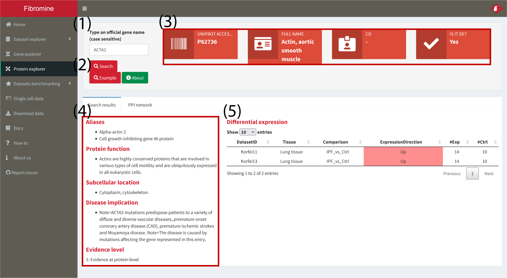
</a>

---

#### 4. Creation of a condition-specific protein-protein interaction network.

1. To construct a condition specific protein-protein interaction (PPI) network, first search for a specific protein as described in step 1 of **3. Search for the expression pattern of a specific protein.**.

2. Then, move to the **PPI network (1)** tab of the **Protein explorer** and press the **Plot (2)** button. The network should be created within a few seconds.

	

3. To annotate the network **select tissue (3)** and then **comparison (4)** from the homonym dropdown menus at the right of the network. Finally press the **Annotate (5)** button and wait for a few seconds. In order to annotate the network using data from different conditions, press the **Reset** button next to **Annotate (5)**. To further fine-tune network annotation, change the p-value and fold change thresholds used.

	<a href= "howToScreenshots/proteinExpl3.png" target="_blank" rel='noopener noreferrer'> 
		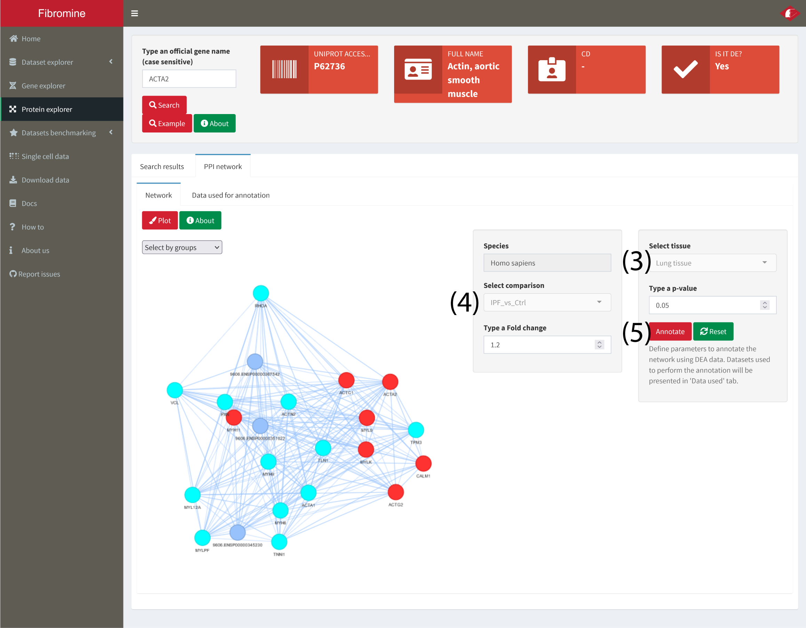
	</a>

4. For transparency reasons, the data used to annotate the network are presented into the **Data used (6)** tab.
	
	<a href= "howToScreenshots/proteinExpl4.png" target="_blank" rel='noopener noreferrer'> 
		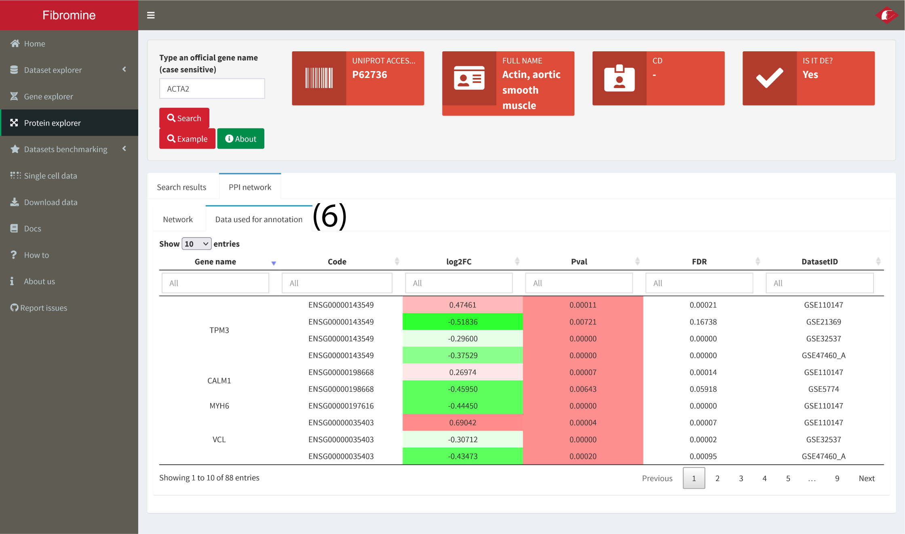
	</a>

---

#### 5. Download data

1. To download data for any downstream analysis/procedure, navigate to the **Download data** tab and use the **dropdown menus (1-2)** of the page to fetch the normalized data of any transcriptomic dataset, or the differential expression data of any proteomic one.

	

---

#### 6. Get more detailed information

1. To obtain more detailed information about Fibromine, please visit the **Docs** tab. 

	
